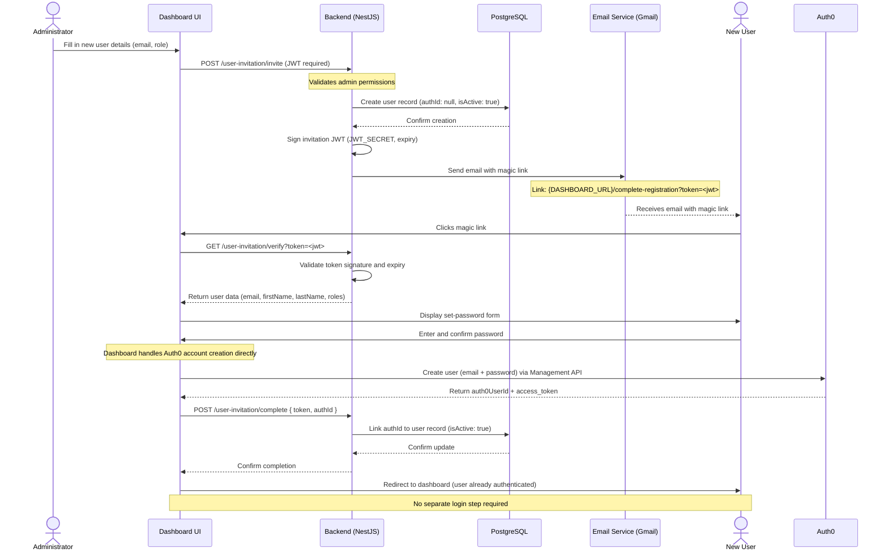

# 02 — Data Flows

## 1. User Request Lifecycle

Standard authenticated API request from any client (app or dashboard):

```
Client
  │
  │  HTTPS request (Bearer JWT in Authorization header)
  ▼
OVH Load Balancer
  │
  ▼
Nginx Ingress (TLS termination)
  │
  ▼
Kubernetes Service (ClusterIP)
  │
  ▼
NestJS API Pod
  │
  ├─ JwtAuthGuard → validates JWT signature against Auth0 JWKS endpoint
  ├─ RolesGuard → checks role claim in JWT payload
  ├─ Controller → maps route, validates DTO via class-validator
  ├─ Service layer → business logic
  │
  ▼
TypeORM Repository
  │
  ▼
OVH Managed PostgreSQL (private vRack IP)
  │
  ▼
Response serialised → JSON → Client
```

**Latency notes:**
- JWKS public keys are cached in-process by `jwks-rsa`; no Auth0 round-trip on every request.
- Database connections are pooled via TypeORM's built-in connection pool.

---

## 2. Authentication Flow (Auth0)

The dashboard uses a **custom authentication implementation** — All auth is handled through Next.js API routes using the **Resource Owner Password Credentials (ROPC)** grant and an HttpOnly cookie.

### 2.1 Dashboard Login

```
User (browser)
  │
  │  1. Submits email + password on custom /login page
  ▼
dashboard — POST /api/auth/login  (Next.js API route)
  │
  ├─ 2. Decrypts password payload (client-side encryption)
  │
  ├─ 3. POST {AUTH0_ISSUER_URL}/oauth/token
  │         grant_type: password
  │         connection: Username-Password-Authentication
  │         client_id, client_secret, audience, scope: openid profile email
  │
  ├─ 4. Auth0 returns access_token (JWT)
  │
  ├─ 5. Validates user status in DB:
  │         GET {API}/users/email/:email  (Authorization: Bearer <access_token>)
  │         → 423 if Auth0 reports account blocked
  │         → 403 if user.isActive === false
  │         → 403 if organization.status === 'inactive'
  │
  └─ 6. Sets HttpOnly cookie and returns 200:
            Set-Cookie: token=<access_token>; Path=/; HttpOnly; Secure; SameSite=Strict
  ▼
User is logged in — browser holds the token in an HttpOnly cookie
```

> Subsequent authenticated requests to the NestJS API are covered in Section 1 (User Request Lifecycle).

### 2.2 Logout

```
User clicks logout
  │
  ▼
dashboard — GET /api/auth/logout  (Next.js API route)
  │
  └─ Clears token cookie (expires: new Date(0))
     No Auth0 session invalidation — token remains valid until Auth0 expiry
```

### 2.3 Password Reset

```
User requests reset on /reset-password page
  │
  ▼
dashboard — POST /api/auth/reset-password  (Next.js API route)
  │
  └─ POST {AUTH0_ISSUER_URL}/dbconnections/change_password
       connection: Username-Password-Authentication
  │
  ▼
Auth0 sends password reset email directly to user
```

### 2.4 Public App (No login required)

`apps/app` does not use authentication. Organisation context is resolved from the URL key parameter. Assessment state is held in browser session storage and submitted to the NestJS API on completion.

### 2.5 User Invitation & Registration Flow

#### Sequence Diagram



#### Step-by-Step Flow

**Phase 1 — Admin sends invitation**

```
Admin (dashboard)
  │
  │  POST /user-invitation/invite  { email, firstName, lastName, roles, organizationId }
  │  Authorization: Bearer <admin-access-token>
  ▼
NestJS — UserInvitationModule
  │
  ├─ 1. Validates JWT + admin role (JwtAuthGuard + AuthRoleGuard)
  ├─ 2. Creates user record in PostgreSQL  { authId: null, isActive: true }
  ├─ 3. Signs invitation JWT  { email, roles, organizationId, type: 'invitation' }
  │      Signed with JWT_SECRET, expires in INVITATION_TOKEN_EXPIRATION
  └─ 4. Sends magic-link email via Gmail OAuth2 (EJS template)
         URL: {DASHBOARD_URL}/complete-registration?token=<jwt>
```

**Phase 2 — User opens the link and verifies the token**

```
User clicks link in email
  │
  ▼
dashboard — /complete-registration?token=<jwt>
  │
  │  GET /user-invitation/verify?token=<jwt>  (public endpoint)
  ▼
NestJS
  │
  ├─ Verifies JWT signature and expiry (JWT_SECRET)
  └─ Returns { email, firstName, lastName, roles, organizationId }
  ▼
Dashboard displays set-password form pre-filled with user data
```

**Phase 3 — User sets password and completes registration**

```
User submits password
  │
  ▼
dashboard — POST /api/auth/complete-registration  (Next.js API route)
  │
  ├─ 1. POST {AUTH0_ISSUER_URL}/oauth/token  (grant_type: client_credentials)
  │         → obtains Auth0 Management API token
  │
  ├─ 2. POST {AUTH0_ISSUER_URL}/api/v2/users
  │         body: { email, password, name, connection }
  │         → creates Auth0 account, returns auth0UserId
  │
  ├─ 3. POST {AUTH0_ISSUER_URL}/api/v2/users/:auth0UserId/roles
  │         → assigns AUTH0_USER_ROLE or AUTH0_ADMIN_ROLE
  │
  ├─ 4. POST {API}/user-invitation/complete  { token, authId: auth0UserId }
  │         → NestJS links authId to DB user record (isActive: true)
  │
  └─ 5. Sets HttpOnly cookie with access_token
            Set-Cookie: token=<access_token>; HttpOnly; Secure; SameSite=Strict
  ▼
User is redirected to /dashboard — already authenticated, no login step required
```

**Key points:**
- The NestJS backend never calls Auth0 directly during this flow. Auth0 account creation is fully handled by the Dashboard (`/api/auth/complete-registration`) using the Management API.
- The invitation JWT (`JWT_SECRET`) and the Auth0 `access_token` are two distinct tokens with separate purposes: the first is a one-time registration link; the second is the session credential.
- If the token has expired, the admin uses `POST /user-invitation/resend`. This re-signs the JWT and resets `createdAt` on the user record to restart the expiry window.

---

## 3. Email Sending Flow

All outbound email is sent through Gmail OAuth2 using Nodemailer. There is no SMTP password — authentication uses a long-lived refresh token.

```
NestJS MailModule
  │
  ├─ 1. Uses googleapis to obtain a short-lived access_token
  │     from GMAIL_REFRESH_TOKEN + GMAIL_CLIENT_ID + GMAIL_CLIENT_SECRET
  │
  ├─ 2. Passes access_token to Nodemailer as OAuth2 transport credentials
  │
  ├─ 3. Renders EJS template (e.g. apps/api/src/modules/user-invitation/templates/)
  │
  └─ 4. Sends email from MAIL_FROM via Gmail SMTP (smtp.gmail.com:465)
```

**Failure handling:** Email send errors are caught and logged. The API returns a success response to the caller if the database write succeeded — email delivery failure does not roll back the invitation record. Retry logic must be handled operationally.

---

## 4. PDF Report Generation Flow

```
Client
  │
  │  POST /report (with assessment results payload)
  ▼
NestJS ReportModule
  │
  ├─ 1. Fetches organisation branding (theme, font, logo from OVH S3)
  ├─ 2. Renders report HTML via EJS template
  ├─ 3. Launches headless Chromium via Puppeteer
  ├─ 4. Puppeteer renders HTML → exports PDF buffer
  ├─ 5. Optionally uploads PDF to OVH S3 bucket
  │
  ▼
Response: PDF file download (application/pdf) or S3 presigned URL
```

**Note:** Puppeteer runs inside the API container. The Docker image must include Chromium dependencies. Memory limits on the API pods must account for Puppeteer's Chromium footprint (~150–300 MB per render).

---

## 5. CI/CD Flow

```
Developer
  │
  │  git push → feature branch or main
  ▼
GitHub Actions (CI)
  │
  ├─ 1. Checkout repository
  ├─ 2. yarn install + lint + type-check + test
  ├─ 3. Docker build (multi-stage) for api / app / dashboard
  ├─ 4. Tag image: registry.example.com/maturoscope/<app>:<git-sha>
  ├─ 5. Push image to Harbor private registry
  ├─ 6. Harbor runs vulnerability scan on pushed image
  ├─ 7. Update image tag in infra repository (kustomize overlay)
  │      → opens PR or commits directly to infra/overlays/staging or production
  │
  ▼
Argo CD (watching infra repository)
  │
  ├─ 8. Detects diff in overlay image tag
  ├─ 9. Syncs Kubernetes resources to cluster (kubectl apply)
  ├─ 10. Kubernetes performs rolling update (zero-downtime)
  │
  ▼
New container version running in cluster
```

See `04-cicd-and-deployment.md` for full pipeline detail.

---

## 6. Secrets Flow

```
GitHub Actions
  │
  ├─ Reads secrets from GitHub repository secrets store
  │   (HARBOR_USERNAME, HARBOR_PASSWORD, KUBECONFIG, etc.)
  │
  ├─ At deploy step: writes Kubernetes Secrets via kubectl or
  │   updates sealed-secrets / external-secrets manifests in infra repo
  │
  ▼
Kubernetes Secrets (base64-encoded, encrypted at rest in etcd)
  │
  ▼
Mounted as environment variables into API / app / dashboard pods
  │
  ▼
NestJS ConfigModule reads process.env at startup
```

**Secret categories:**

| Secret | Injected into |
|---|---|
| `DB_HOST`, `DB_PASS`, `DB_USER`, `DB_NAME` | `api` pod |
| `AUTH0_*` | `api` pod, `dashboard` pod |
| `OVH_S3_*` | `api` pod |
| `GMAIL_*`, `MAIL_*`, `JWT_SECRET` | `api` pod |
| `NEXT_PUBLIC_GATEWAY_URL` | `app` + `dashboard` build args |
| `NEXT_SERVER_ACTIONS_ENCRYPTION_KEY` | `dashboard` pod |

---

## 7. Inter-Service Communication

| From | To | Method |
|---|---|---|
| `apps/app` (Next.js Server Actions) | `apps/api` | HTTP REST (internal cluster DNS) |
| `apps/dashboard` (Next.js API routes) | `apps/api` | HTTP REST (internal cluster DNS) |
| `apps/api` | Auth0 Management API | HTTPS (external) |
| `apps/api` | OVH S3 | HTTPS via AWS SDK v3 (external) |
| `apps/api` | Gmail SMTP | HTTPS OAuth2 + SMTP (external) |
| `apps/api` | PostgreSQL | TCP 5432 (private vRack) |

No message queue or event bus is used. All communication is synchronous request/response.

---

## 8. Failure Scenarios & Handling

| Scenario | Impact | Handling |
|---|---|---|
| Auth0 JWKS endpoint unreachable | All authenticated API requests fail | `jwks-rsa` caches keys; short-term outage tolerated. Alert on sustained failures. |
| PostgreSQL connection lost | API returns 500 on DB-dependent routes | TypeORM retries with exponential backoff on connection. Pods restart on repeated failure (liveness probe). |
| Harbor registry unavailable | New deployments blocked | Existing running pods are unaffected. CI pipeline fails gracefully with error. |
| Argo CD sync failure | Cluster state not updated | Argo CD marks application as `OutOfSync`. No automatic rollback. Operator manually resolves. |
| Gmail OAuth2 token expired | Invitation emails fail | Operator must rotate `GMAIL_REFRESH_TOKEN` and update Kubernetes Secret. |
| OVH S3 unreachable | PDF uploads fail; file downloads fail | API returns error to client. Core assessment flow (non-PDF) unaffected. |
| Puppeteer crash during PDF render | 500 returned to client | Puppeteer is launched per-request; crash does not affect other requests. Pod restart not triggered unless process exits. |
| Pod OOMKilled (Puppeteer) | API pod restarts | Increase memory limits on `api` Deployment. Puppeteer concurrency should be limited. |
| Node pool maintenance (OVH) | Rolling pod eviction | PodDisruptionBudget ensures minimum 1 replica available. Rolling update handles gracefully. |
